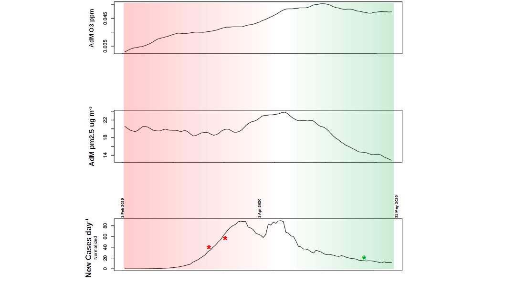
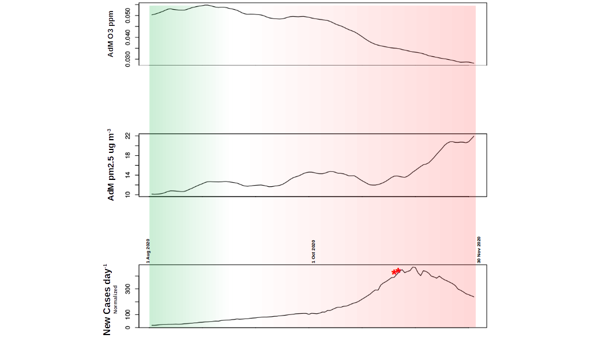
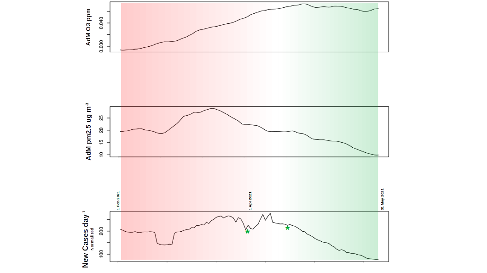

# Table of Contents

1.  [&lt;2021-06-05 Sat&gt;  Data Download](#orgf3872a5)
3.  [Periods and Figures discussion](#org2cb4de6)

In this general overview we compare the average profile of O3,
PM2.5 and infection in defined periods of time.

# &lt;2021-06-05 Sat&gt;  Data Download

Data are downloaded from [https://github.com/owid/covid-19-data/tree/master/public/data](https://github.com/owid/covid-19-data/tree/master/public/data) 

Environmental data are downloaded from
<https://www.regional.atmosphere.copernicus.eu/> and elaborated as
described in the original paper (<https://www.ncbi.nlm.nih.gov/pmc/articles/PMC7354543/>)

Average daily maximum (AdM) concentration of ozone and pm2.5 are expressed as ppm and ug/m3 respectively (<https://www.ncbi.nlm.nih.gov/pmc/articles/PMC7354543/>).

# Periods and Figures discussion

The original figures are modified to express overall observations
concerning three foremost periods (in Europe) starting from 2020-02-01.

<table id="org163aa7e" border="2" cellspacing="0" cellpadding="6" rules="groups" frame="hsides">

<colgroup>
<col  class="org-right" />

<col  class="org-right" />

<col  class="org-left" />

<col  class="org-left" />
</colgroup>
<thead>
<tr>
<th scope="col" class="org-right">Start Period</th>
<th scope="col" class="org-right">End Period</th>
<th scope="col" class="org-left">Description</th>
<th scope="col" class="org-left">Status change</th>
</tr>
</thead>

<tbody>
<tr>
<td class="org-right">2020-02-01</td>
<td class="org-right">2020-05-31</td>
<td class="org-left">First wave</td>
<td class="org-left">`N -> I -> N`</td>
</tr>

<tr>
<td class="org-right">2020-08-01</td>
<td class="org-right">2020-11-30</td>
<td class="org-left">Start second wave</td>
<td class="org-left">`N -> I`</td>
</tr>

<tr>
<td class="org-right">2021-02-01</td>
<td class="org-right">2021-05-31</td>
<td class="org-left">End second wave</td>
<td class="org-left">`I -> N`</td>
</tr>
</tbody>
</table>

For simplicity, we approximate the viral infectivity with only two states:
infective (I) and non-infective (N). Moreover, we decided that for
being considered non-infective, the virus must drop under 100 cases. 

We selected those periods because we find that contain main
events. We can summarize our observation here:

1.  The periods contain a status change in the virus infectivity.  It
    is clear, as an example, that in the first wave (see Figure below)
    the virus becomes active in the first two months and inactive in
    the second two.
    
2.  The second wave, duration is long-lasting. Since autumn 2020, the
    number of new cases newer dropped under 150 cases per million in
    average in Europe. We split this wave into two separate periods (see
    the first Table).
3.  In the first wave, Europe introduced (red asterisks) and removed
    (green asterisks) restrictions to the citizens in about two months.
4.  In the second wave the introduction of the restrictions started in
    November 2020, and the restrictions are (partially) removed in
    April/May, after about 5/6 months.
    
    
5.  Despite the vaccination policies, the prolonged lock-down, and the
    sanitary measures, the viral activity decreases with a similar
    pattern in the two waves.
    
    
    
We think that the environmental conditions are playing a major role in
"switching" the viral activity ON/OFF and back.

We are well aware of the limitation of our work that is still
entirely based on data collected at the very beginning of the pandemic
(February-March 2020). A more detailed predictive model must be
released as soon as possible

1.  introducing detailed epidemiological data that cover more than a
    year of the pandemic;
2.  using geographical variables for correcting environmental biases
    (e.g., pollution levels) caused by peculiar regional conditions;
3.  testing more sophisticated measures for capturing the viral
    activity (e.g., first-order measures);
4.  computing a prediction map where most of the European cities are
    included;
5.  extending the prediction to extra-European countries.

